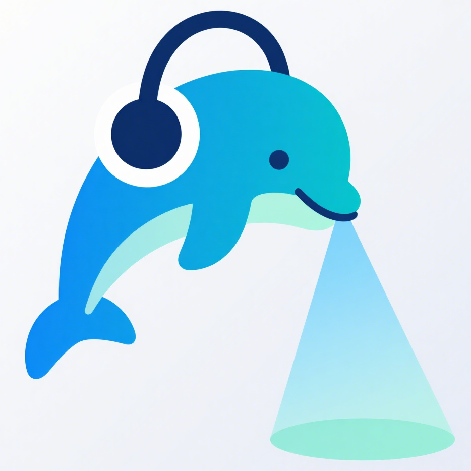
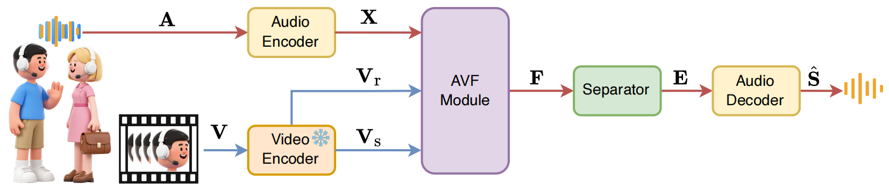
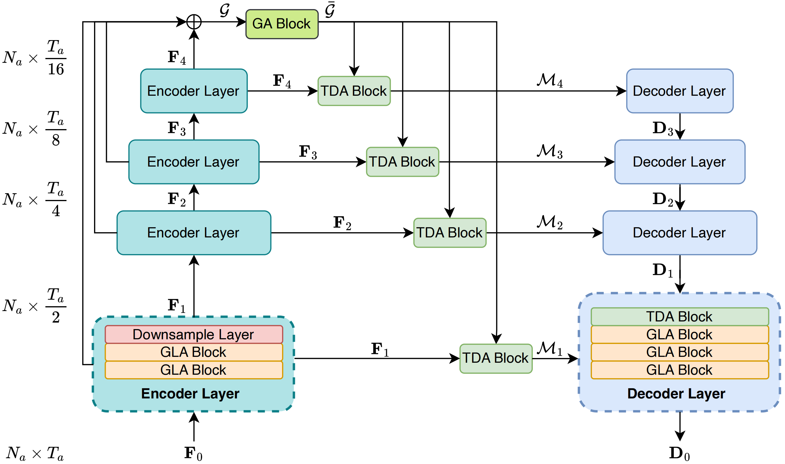
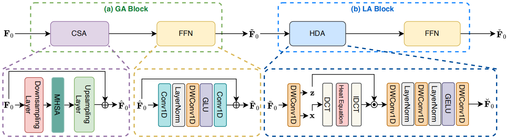
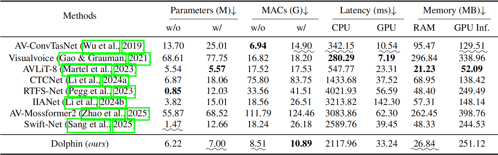

<p align="center">
  
</p>
<h3 align="center">Efficient Audio-Visual Speech Separation with Discrete Lip Semantics and Multi-Scale Global-Local Attention</h3>

<p align="center">

> Dolphin is an efficient audio-visual speech separation framework that leverages discrete lip semantics and hierarchical attention mechanisms to achieve state-of-the-art performance with significantly reduced computational complexity.

## 🎯 Highlights

- **50%+ Parameter Reduction**: Achieves superior performance with less than half the parameters of SOTA methods
- **6× Faster Inference**: Dramatically accelerates GPU inference speed for real-world deployment
- **Discrete Lip Semantics**: Maps continuous lip movements into phoneme-aligned discrete units
- **Global-Local Attention**: Efficiently capture multi-scale dependencies.


## 📜 Abstract

Audio-visual speech separation (AVSS) methods leverage visual cues to extract
target speech and have demonstrated strong separation quality in noisy acoustic
environments. However, these methods usually involve a large number of param-
eters and require high computational cost, which is unacceptable in many appli-
cations where speech separation severs as only a preprocessing step for further
speech processing. To address this issue, we propose an efficient AVSS method,
named Dolphin. For visual feature extraction, we develop DP-LipCoder, a
dual-path lightweight video encoder that transforms lip-motion into audio-aligned
discrete semantic tokens. For audio separation, we construct a lightweight en-
coder–decoder separator, in which each layer incorporates a global–local atten-
tion (GLA) block to efficiently capture multi-scale dependencies. Experiments
on three benchmark datasets showed that Dolphin not only surpassed the current
state-of-the-art (SOTA) model in separation quality but also achieved remarkable
improvements in efficiency: over 50% fewer parameters, more than 2.4× reduc-
tion in MACs, and over 6× faster GPU inference speed. These results indicate that
Dolphin offers a practical and deployable solution for high-performance AVSS in
real-world scenarios. Our code and demo page are publicly available at this link.

## 🏗️ Architecture



> The overall architecture of Dolphin.

### Video Encoder


> The video encoder of Dolphin.

### Dolphin Model Overview



> The overall architecture of Dolphin's separator.

### Key Components



## 📊 Results

### Performance Comparison

Performance metrics on three public AVSS benchmark datasets. Bold indicates best performance.


### Efficiency Analysis



Dolphin achieves:
- ✅ **>50%** parameter reduction
- ✅ **2.4×** lower computational cost (MACs)
- ✅ **6×** faster GPU inference speed
- ✅ Superior separation quality across all metrics

## 📦 Installation

```bash
git clone https://github.com/Dolphin-AVSS/Dolphin.git
cd Dolphin
pip install torch torchvision
pip install -r requirements.txt
```

### Requirements

- Python >= 3.10
- PyTorch >= 2.5.0
- CUDA >= 12.4
- Other dependencies in requirements.txt

## 🚀 Quick Start

### Inference with Pre-trained Model

```python
# Single audio-visual separation
python inference.py \
    --input /path/to/video.mp4 \
    --output /path/to/output/directory \
    --speakers 2 \
    --detect-every-n 8 \
    --face-scale 1.5 \
    --cuda-device 0 \
    --config checkpoints/vox2/conf.yml
```

## 📁 Model Zoo

| Model | Training Data | SI-SNRi | PESQ | Download |
|-------|--------------|---------|------|----------|
| Dolphin | VoxCeleb2 | 16.1 dB | 3.45 | [Link](#) |

## 📖 Citation

If you find Dolphin useful in your research, please cite:

## 🤝 Acknowledgments

We thank the authors of [IIANet](https://github.com/JusperLee/IIANet) and [SepReformer](https://github.com/dmlguq456/SepReformer) for providing parts of the code used in this project.

## 📄 License

This project is licensed under the MIT License - see the [LICENSE](LICENSE) file for details.